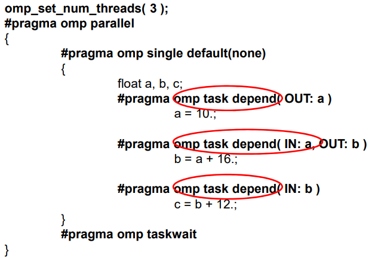
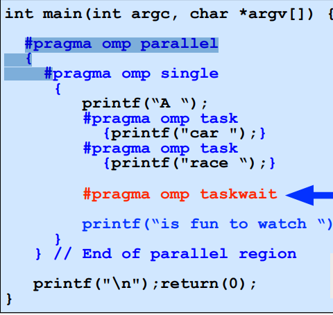
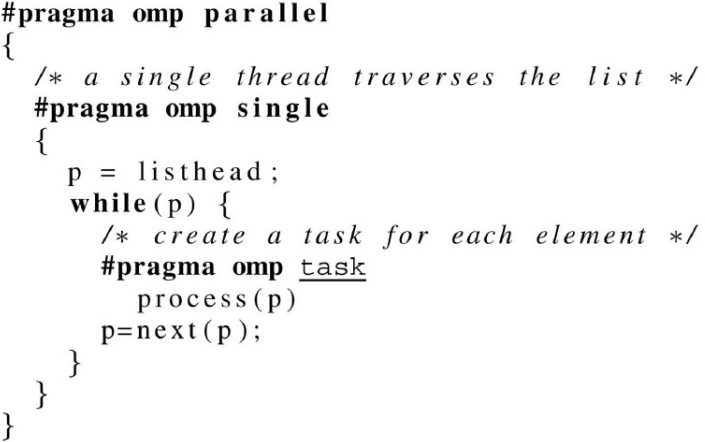

# Tasks 
* Aluno: Cicero Igor Alves Torquato dos Santos
* Disciplina: Programação Concorrente 

## Introdução 

Um dos problemas do OpenMP sections é que suas seções são **estáticas** , ou seja , são boas se sabemos quantas delas nós usaremos.  
O OpenMP Tasks surge como uma ferramenta para resolver esse problema, já que torna o número total de tarefas a ser utilizado seja **dinâmico**. 
Ao escrever um código com o OpenMP tasks a nova tarefa é incluída em uma **lista de tarefas** e a nova tarefa pode ser executada imediatamente ou pode ser adiada. 
*Importante:* Deve haver um conjunto de encadeamento de threads em paralelo existente para que isso funcione. Caso contrário, uma thread acaba fazendo todas as tarefas e você não obtém nenhuma contribuição para o paralelismo. 

## OpenMP sections X OpenMP tasks

As tasks são muito parecidas com as sections do OpenMP, mas as sections são estáticas, ou seja, o número de seções é definido quando você escreve o código, enquanto as tasks podem ser criadas a qualquer momento e em qualquer número, sob controle da lógica do seu programa.

## Como funcionam as tasks

Uma task explícita pode ser executada por qualquer thread e em paralelo com outras tarefas sendo que sua execução pode ser imediata ou adiada até um momento posterior.  
Uma tarefa que está sendo executada atualmente por uma thread é chamada de **tarefa corrente (atual)**.  

**Variáveis:**

* Shared: é a variável anteriormente definida, compartilhada por todos.
* Private: é criada uma nova variável privada, sem inicialização.
* Firstprivate: é criada uma nova variável privada, inicializada para o valor que tinha antes da task.

**Taskwait** faz com que a execução da task corrente seja suspensa até que todas as suas tasks filhas sejam completadas.

*Lembrando que* a menos que você faça alguns arranjos especiais, a ordem de execução das diferentes tarefas é indefinida. Observe o exemplo: 

Isso mantém as devidas dependências, mas, por envolver todas as tarefas, essencialmente serializa o paralelismo delas. Isso quer dizer que não se pode exagerar nas dependências.

## Criação das tasks

Inicialmente, vamos usar o seguinte exemplo para a criação das taks com o OpenMP

1. #pragma omp task
2. barreira (implícita ou explícita)
3. #pragma omp taskwait
4. #pragma omp taskgroup

Nesse sentido, as tasks definidas serão geradas para serem executadas nas threads.

Exemplo Inicial com tasks  

**Importante:**

* Tasks não substituem tudo.
* Por exemplo, se a construção do loop funcionar bem não é necessário usar as taks.
* Considere usar as tasks quando as coisas forem muito mais dinâmicas ou se você não pode prever quanto trabalho será feito.
* Também pode-se usar as tasks quando a carga de trabalho estiver desequilibrada.
